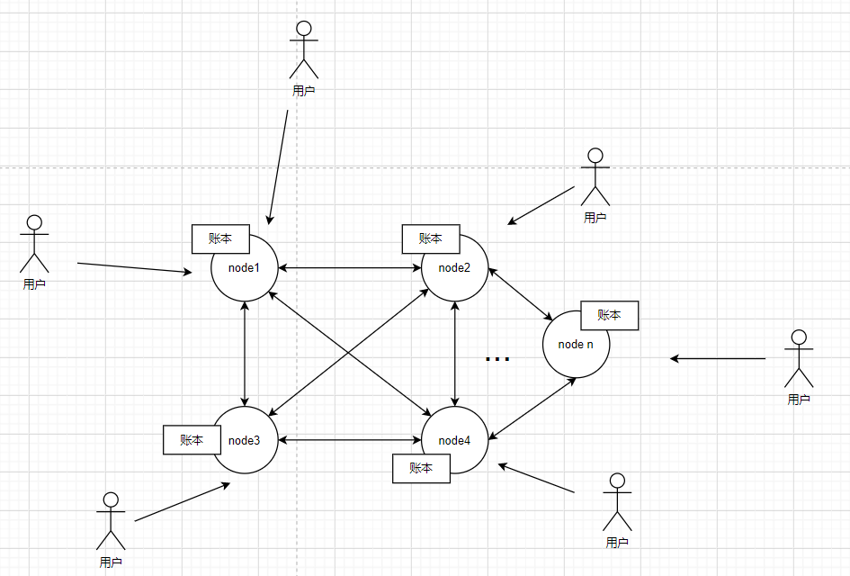
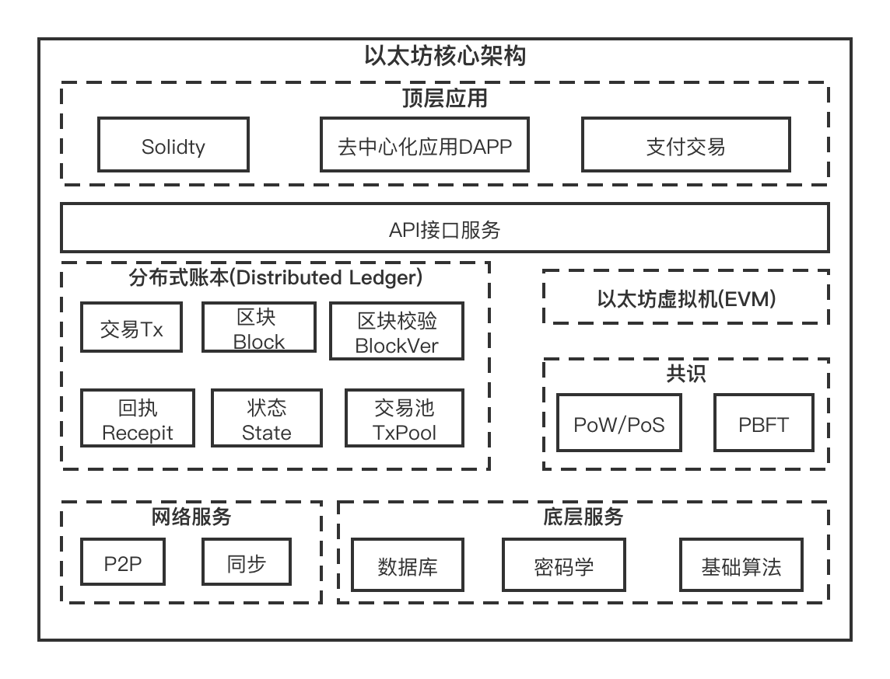

# 区块链与substrate

从2008年中本聪发布《比特币：一种点对点的电子现金系统》开始，区块链技术开始进入我们的世界，区块链防篡改、去信任等等概念更是被炒的热火朝天。那么什么是区块链，它能做什么？到底有没有前途？这不是我们这节要回答的问题（这个机灵是不是抖的很ok？:)）我们这节要讲的，是一个区块链系统应用的大体表现形式，有些概念或者表达可能不太准确，但是没有关系，这节的内容只是为了帮我们能更好的学习substrate而已。

## 1 区块链系统是什么样的
很多资料都会提到这点，区块链是一个分布式的数据库，本质是一个分布式的账本。既然是分布式的，那当然具备分布式的特征，既然是数据库，是账本，那么当然能够记录数据。关于区块链是怎样记账的文档很多，此处我们不再累述。

要学习substrate，区块链系统具体是怎么去信任、防篡改的，我们可以不用了解太深，但是区块链系统大概长什么样子，是必须要知道的。就像我们要用积木搭一个城堡，可以不用知道从头开始建城堡的实际步骤，但是城堡的大概样子还是要知道的，否则即使有积木也不知道怎么搭。

### 1.1 区块链的大体样貌
下图就是区块链系统的大体样貌（表现形式）。

从上图中，我们可以看出区块链的几个特点：
* 是一个分布式的系统；
* 每个节点都有一个账本；
* 每个节点的账本都基本上按照同样的逻辑记账；
* 用户可以访问其中的任何一个节点就可以访问系统。（为了好理解，这里全是全节点）

### 1.2 区块链程序的组织结构
上面我们是用户试图看到的区块链系统的表现形式，这里我们看看从代码实现层面区块链的组成。下面是以太坊的架构图：

以太坊很具有代表性，大部分的区块链通常都是这个架构。不过我们放这张图的目的并不是为了后面实现这张图里类似的组件。

## 2 substrate与区块链开发
如果没有substrate，那么我们开发一条区块链基本上是要自己来实现网络、共识、交易池等等组件的，也就是前面区块链架构里面的那些东西。而substrate里面就是像提供积木一样提供了这些组件，然后我们可以像搭积木一样根据需求搭建出一条条的区块链。

