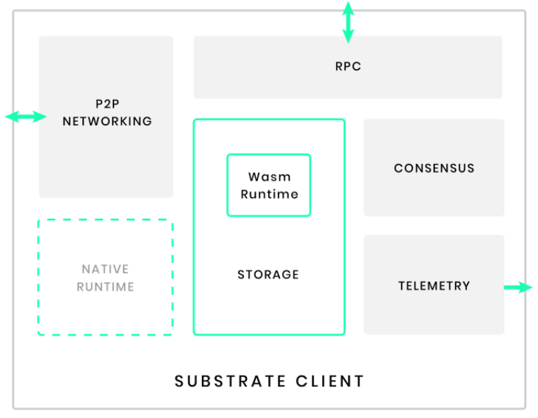

# substrate快速了解

## 1 substrate的应用方式

有以下三种方式来使用substrate开发区块链：

* 直接使用substrate node

上一节中快速体验substrate创建一条链就是使用的这种方式，这种方式基本上不修改代码，配置一下chain_spec即可（也可以用默认的）。如果玩过bitcoin或者ethereum开发的小伙伴，想想一下修改genesis block的配置起一个类似的节点直接山寨一条链，基本就和这种使用方式类似。

* 使用substrate frame构建运行时

这种方式就是substrate提供的大的框架下，定义自己的运行时（也就是链的一些具体逻辑），然后形成一条新的链。这个理解起来可能有些费解，举个例子，我们在前面的章节给大家介绍过以太坊的架构，也是常见的区块链的架构，在这个架构中，有一个组件是共识，不同的链可能使用不同的共识。如果我们要实现有着不同共识的链，我们就可以用这种方式来开发，将里面对应的公式模块弄成我们想要的即可。在这种方式中，主要开发的就是这些模块，substrate中叫做pallet。subtrate自身提供了一些lib和pallet，我们也可以自己开发一些pallet。

这种方式也是这份教程教大家的方式。

* 使用substrate core

这种方式是最灵活的方式，但是也是难度最大的方式。这种方式可以忽略substrate中提供的frame，支持完全自定义的开发。这种方式后续在本教程中不加讨论。

## 2 substrate链的架构

既然我们主要是使用substrate构建运行时的方式开发，那么这样开发出来的链的架构是怎么样的呢？substrate官方文档已经给我们画出来了，如下：

在这个架构中，已经给我们提供了基本的网络、rpc等这些模块，那么其它的应用逻辑模块就可以使用前面说的第二种方式进行开发，从而实现特定应用的特定的区块链。

## 3 参考文档

https://docs.substrate.io/v3/getting-started/overview/

https://docs.substrate.io/v3/getting-started/architecture/
