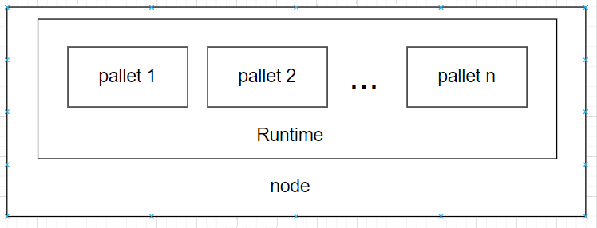

# 编写简单的pallet
## 1 node-template的结构
我们下载node-template（地址：https://github.com/substrate-developer-hub/substrate-node-template), 然后进入到node-template查看目录结构：
```
~/Source/learn/substrate-node-template$ tree -L 3
.
├── Cargo.lock
├── Cargo.toml
├── docker-compose.yml
├── docs
│   └── rust-setup.md
├── LICENSE
├── node
│   ├── build.rs
│   ├── Cargo.toml
│   └── src
│       ├── chain_spec.rs
│       ├── cli.rs
│       ├── command.rs
│       ├── lib.rs
│       ├── main.rs
│       ├── rpc.rs
│       └── service.rs
├── pallets
│   └── template
│       ├── Cargo.toml
│       ├── README.md
│       └── src
├── README.md
├── runtime
│   ├── build.rs
│   ├── Cargo.toml
│   └── src
│       └── lib.rs
├── rustfmt.toml
├── scripts
│   ├── docker_run.sh
│   └── init.sh
└── shell.nix
```
在上述的目录结构中，node目录中是链的一些基础功能的实现（或者说比较底层的实现，如网络、rpc，搭建链的最基础的code); pallet目录中放置的就是各个pallet，也就是业务相关的模块; runtime目录中可以简单理解为把所有pallet组合到一起，也就是业务相关的逻辑，这部分和pallet目录中是我们开发中经常要动到的部分，而node中则相对来说动的少一点。

如果用一张图来展示它们之间的关系的话，可能是这样(不太准确，但大体是这么个意思)：


当然，对于pallets来说，在runtime中使用的pallet，有些是我们自己开发的pallet，有些是substrate中已经开发好的pallet，甚至还有些是pallet是第三方开发的pallet。

## 2 编写pallet 
下面我们就开始写一个简单的pallet。

### 2.1 编写pallet的一般格式

写pallet的基本格式如下：
```
// 1. Imports and Dependencies
pub use pallet::*;
#[frame_support::pallet]
pub mod pallet {
    use frame_support::pallet_prelude::*;
    use frame_system::pallet_prelude::*;

    // 2. Declaration of the Pallet type
    // This is a placeholder to implement traits and methods.
    #[pallet::pallet]
    #[pallet::generate_store(pub(super) trait Store)]
    pub struct Pallet<T>(_);

    // 3. Runtime Configuration Trait
    // All types and constants go here.
    // Use #[pallet::constant] and #[pallet::extra_constants]
    // to pass in values to metadata.
    #[pallet::config]
    pub trait Config: frame_system::Config { ... }

    // 4. Runtime Storage
    // Use to declare storage items.
    #[pallet::storage]
    #[pallet::getter(fn something)]
    pub MyStorage<T: Config> = StorageValue<_, u32>;

    // 5. Runtime Events
    // Can stringify event types to metadata.
    #[pallet::event]
    #[pallet::generate_deposit(pub(super) fn deposit_event)]
    pub enum Event<T: Config> { ... }

    // 6. Hooks
    // Define some logic that should be executed
    // regularly in some context, for e.g. on_initialize.
    #[pallet::hooks]
    impl<T: Config> Hooks<BlockNumberFor<T>> for Pallet<T> { ... }

    // 7. Extrinsics
    // Functions that are callable from outside the runtime.
    #[pallet::call]
    impl<T:Config> Pallet<T> { ... }

}
```
在我们开始写一个pallet的时候，首先先把这个模板贴到编辑器里面，然后再针对我们具体的需求进行修改。所以从这里可以看出，一个pallet，如果所有功能都包括的话，基本上分为这几大部分(对应上面代码注释中的1-7)：
```
1. 依赖; 
2. pallet类型声明;
3. config trait;
4. 定义要使用的链上存储;
5. 事件;
6. 钩子函数;
7. 交易调用函数;
```
1和2基本上是固定的写法，而对于后面的3-7部分，则是根据实际需要写或者不写。关于模板中每部分的解释，可以参考[文档](https://docs.substrate.io/v3/runtime/frame/#pallets).

### 2.2 编写pallet


## 3 将pallet添加到runtime中

## 4 调试使用pallet中的功能

## 5 参考文档
https://docs.substrate.io/v3/runtime/frame/#pallets
