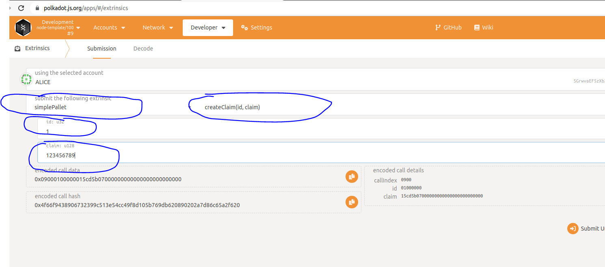
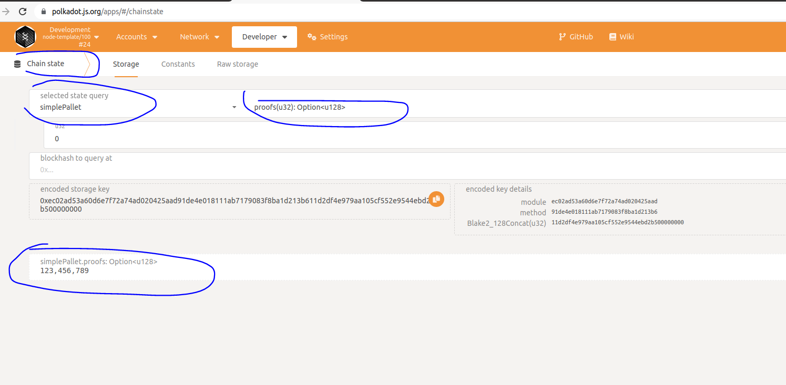

# 编写简单的pallet
## 1 node-template的结构
我们下载node-template（地址：https://github.com/substrate-developer-hub/substrate-node-template), 然后进入到node-template查看目录结构：
```
~/Source/learn/substrate-node-template$ tree -L 3
.
├── Cargo.lock
├── Cargo.toml
├── docker-compose.yml
├── docs
│   └── rust-setup.md
├── LICENSE
├── node
│   ├── build.rs
│   ├── Cargo.toml
│   └── src
│       ├── chain_spec.rs
│       ├── cli.rs
│       ├── command.rs
│       ├── lib.rs
│       ├── main.rs
│       ├── rpc.rs
│       └── service.rs
├── pallets
│   └── template
│       ├── Cargo.toml
│       ├── README.md
│       └── src
├── README.md
├── runtime
│   ├── build.rs
│   ├── Cargo.toml
│   └── src
│       └── lib.rs
├── rustfmt.toml
├── scripts
│   ├── docker_run.sh
│   └── init.sh
└── shell.nix
```
在上述的目录结构中，node目录中是链的一些基础功能的实现（或者说比较底层的实现，如网络、rpc，搭建链的最基础的code); pallet目录中放置的就是各个pallet，也就是业务相关的模块; runtime目录中可以简单理解为把所有pallet组合到一起，也就是业务相关的逻辑，这部分和pallet目录中是我们开发中经常要动到的部分，而node中则相对来说动的少一点。

如果用一张图来展示它们之间的关系的话，可能是这样(不太准确，但大体是这么个意思)：


当然，对于pallets来说，在runtime中使用的pallet，有些是我们自己开发的pallet，有些是substrate中已经开发好的pallet，甚至还有些是pallet是第三方开发的pallet。

## 2 编写pallet 
下面我们就开始写一个简单的pallet。

### 2.1 编写pallet的一般格式

写pallet的基本格式如下：
```
// 1. Imports and Dependencies
pub use pallet::*;
#[frame_support::pallet]
pub mod pallet {
    use frame_support::pallet_prelude::*;
    use frame_system::pallet_prelude::*;

    // 2. Declaration of the Pallet type
    // This is a placeholder to implement traits and methods.
    #[pallet::pallet]
    #[pallet::generate_store(pub(super) trait Store)]
    pub struct Pallet<T>(_);

    // 3. Runtime Configuration Trait
    // All types and constants go here.
    // Use #[pallet::constant] and #[pallet::extra_constants]
    // to pass in values to metadata.
    #[pallet::config]
    pub trait Config: frame_system::Config { ... }

    // 4. Runtime Storage
    // Use to declare storage items.
    #[pallet::storage]
    #[pallet::getter(fn something)]
    pub MyStorage<T: Config> = StorageValue<_, u32>;

    // 5. Runtime Events
    // Can stringify event types to metadata.
    #[pallet::event]
    #[pallet::generate_deposit(pub(super) fn deposit_event)]
    pub enum Event<T: Config> { ... }

    // 6. Hooks
    // Define some logic that should be executed
    // regularly in some context, for e.g. on_initialize.
    #[pallet::hooks]
    impl<T: Config> Hooks<BlockNumberFor<T>> for Pallet<T> { ... }

    // 7. Extrinsics
    // Functions that are callable from outside the runtime.
    #[pallet::call]
    impl<T:Config> Pallet<T> { ... }

}
```
在我们开始写一个pallet的时候，首先先把这个模板贴到编辑器里面，然后再针对我们具体的需求进行修改。所以从这里可以看出，一个pallet，如果所有功能都包括的话，基本上分为这几大部分(对应上面代码注释中的1-7)：
```
1. 依赖; 
2. pallet类型声明;
3. config trait;
4. 定义要使用的链上存储;
5. 事件;
6. 钩子函数;
7. 交易调用函数;
```
1和2基本上是固定的写法，而对于后面的3-7部分，则是根据实际需要写或者不写。关于模板中每部分的解释，可以参考[文档](https://docs.substrate.io/v3/runtime/frame/#pallets).

### 2.2 编写pallet
接下来我们将编写一个simple-pallet.

#### 2.2.1 simple-pallet功能介绍
simple-pallet是一个存证的pallet，简单说就是提供一个存取一段hash到链上的功能，和从链上读取的功能。

#### 2.2.2 创建目录
进去到我们前面下载的substrate-node-template中，进入到目录pallets中，我们可以创建我们自己的simple-pallet(一般都是在template基础上进行修改)：
```
#先进入到substrate-node-template目录，然后执行如下
cd pallets
cp template/ simple-pallet -rf
cd simple-pallet/src/
rm benchmarking.rs mock.rs tests.rs
```
接下来修改Cargo.toml，打开substrate-node-template/pallets/simple-pallet目录下的Cargo.toml文件，然后进行修改，主要修改内容如下：
```
[package]
name = "pallet-simple-pallet"  #需要修改成自己的名字，这里我们叫做pallet-simple-pallet
...
description = 修改成自己的
authors = 修改成自己的
...
repository = "https://github.com/substrate-developer-hub/substrate-node-template/"
```
对于这个文件中的其它的依赖我们可以暂时先不修改，等代码写完可以再回来删除多余的依赖。

#### 2.2.3 编写代码

删除substrate-node-template/pallets/simple-pallet/src/lib.rs中的代码，然后将上面2.1节中pallet的一般格式的代码拷贝到这个文件中。接下来我们开始写代码，首先对于注释中1和2的部分，我们开始不用修改，对于注释6的部分我们需要删除掉（这个例子中使用不到）。

那么接下来，我们需要修改的就是里面的3、4、5、7的部分，其实对于很多其它的pallet来说，主要也只是修改这几部分。

首先，我们将注释3所在部分confit修改成如下：
```
    #[pallet::config]
	pub trait Config: frame_system::Config {
        type Event: From<Event<Self>> + IsType<<Self as frame_system::Config>::Event>;
    }
```
这里其实就是定义了一个关联类型，这个关联类型需要满足后面的类型约束（From<Event<Self>> + IsType<<Self as frame_system::Config>::Event>）。至于为什么是这样的约束，我们其实可以从字面意思进行理解，一个是可以转换成Event，另外一个就是它是frame_system::Config的Event类型。**对于大部分pallet来说, 如果需要使用到Event，那么都需要在这个Config中进行定义，定义的方式基本一样.**

接下来，我们修改注释4的部分如下：
```
 #[pallet::storage]
    pub type Proofs<T: Config> =
        StorageMap<_, Blake2_128Concat, u32, u128>;
```
关于substrate中的存储，更详细的资料可以参考[文档](https://docs.substrate.io/v3/runtime/storage/)。这里我们简单解释一下，这部分就是在链上定义了一个存储，是一个key-value方式的存储结构，用于存储我们后面要使用的存证，key是u32格式，value也是u128格式。 
	

再接下来，我们修改注释5的部分如下：
```
    #[pallet::event]
    #[pallet::generate_deposit(pub(super) fn deposit_event)]
    pub enum Event<T: Config> {
        ClaimCreated(u32, u128),
    }
```
这里的Event是用来在我们具体的函数中做完动作之后发出的，一般用来通知前端做一些处理。这里我们在Event中定义了一个事件，就是创建存证。

最后，我们修改注释7的部分来实现前面说的创建存证的逻辑，如下：
```
    #[pallet::call]
    impl<T:Config> Pallet<T> { 
        #[pallet::weight(0)]
        pub fn create_claim(origin: OriginFor<T>, id: u32, claim: u128) -> DispatchResultWithPostInfo {
            ensure_signed(origin)?;

            Proofs::<T>::insert(
                &id,
                &claim,
            );

            Self::deposit_event(Event::ClaimCreated(id, claim));

            Ok(().into())
        }
    }
```

至此，我们pallet部分的代码基本上就写完了。


## 3 将pallet添加到runtime中
	
如果用开发一个程序来类别的话，上面写完我们的pallet就类似于我们开发好了一个库（或者说模块），但是这个库还没有真正的用在我们的程序中（链）。接下来就是要在链上使用，就要将pallet添加到runtime中。添加的过程也比较简单，这里我们分两步进行，分别是修改Cargo.toml中和runtime/src/lib.rs中。

### 3.1 修改Cargo.toml
要在runtime中使用我们上面编写的pallet，需要修改substrate-node-template/runtime/Cargo.toml，在其中添加依赖如下：
```
...
[dependencies]
...
pallet-simple-pallet = { version = "4.0.0-dev", default-features = false, path = "../pallets/simple-pallet" } #我们上面编写的pallet
...	

[features]
default = ["std"]
std = [
	...
	"pallet-template/std",
	"pallet-simple-pallet/std", #我们上面编写的pallet
	...
]
```
	
### 3.2 修改runtime/src/lib.rs

在runtime/src/lib.rs中来使用pallet。首先我们需要添加pallet的配置，其实就是指定pallet中Congfig中的关联类型，所以在substrate-node-template/runtime/src/lib.rs中添加如下代码：
```
impl pallet_simple_pallet::Config for Runtime {
	type Event = Event;  //我们上面的定义中只有一个关联类型Event，在此处进行指定，等好右边的Event实际上是frame system中的Event，此处不需要深究，
			     //可以理解为在runtime中已经定义好的一种具体的类型。
}
```
接下来就是把simple_pallet加入到runtime中，修改如下代码：
```
construct_runtime!(
	pub enum Runtime where
		Block = Block,
		NodeBlock = opaque::Block,
		UncheckedExtrinsic = UncheckedExtrinsic
	{
		System: frame_system,
		RandomnessCollectiveFlip: pallet_randomness_collective_flip,
		Timestamp: pallet_timestamp,
		Aura: pallet_aura,
		Grandpa: pallet_grandpa,
		Balances: pallet_balances,
		TransactionPayment: pallet_transaction_payment,
		Sudo: pallet_sudo,
		// Include the custom logic from the pallet-template in the runtime.
		TemplateModule: pallet_template,
		SimplePallet: pallet_simple_pallet, //添加这一行，这里可以看出，实际上我们前面实现的simple-pallet可以理解为一种类型，
						    //然后这里在runtime中定义了一个变量，该变量是这个pallet_simple_pallet类型
	}
);
```
至此，我们就将pallet加入到我们的runtime中了。

### 3.3 编译运行
接下来，我们可以进行编译运行我们的链了。回到substrate-node-template目录，运行如下命令编译：
```
cargo build
```
运行如下命令启动节点：
```
./target/debug/node-template --tmp --dev
```

## 4 调试使用pallet中的功能
此处我们使用polkadot-js-apps和我们刚才运行的节点进行交互。步骤如下：
```
1、在浏览器中输入https://polkadot.js.org/apps；
2、点击左上角会展开；
3、在展开的菜单中点击DEVELOPMENT；
4、点击Local Node；
5、点击switch。
```

接下来我们创建存证：
```
1、选择Developer->Extrinsics->Submission;
2、然后使用Alice账户，选择simplePallet，选择createClaim，输入对应的参数，然后点击右下角的提交即完成了存在的创建。
```
上述过程如下图：


最后我们可以来读取刚才创建的存证：
```
1、选择Developer->Chain State;
2、选择simplePallet，选择proofs，然后点击提交即可。
```
上述过程如下图：



## 5 小节
学到这里，我们基本上就走完了整个pallet开发的流程，你已经可以开发一个简单的pallet了。是不是并没有想想中的那么难？
后续我们再学习学习其它相关的知识，相信你很快就能完全掌握pallet开发了。
	
## 6 参考文档
https://docs.substrate.io/v3/runtime/frame/#pallets
