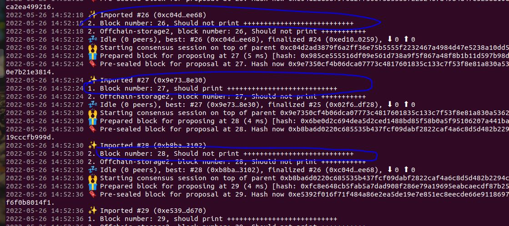
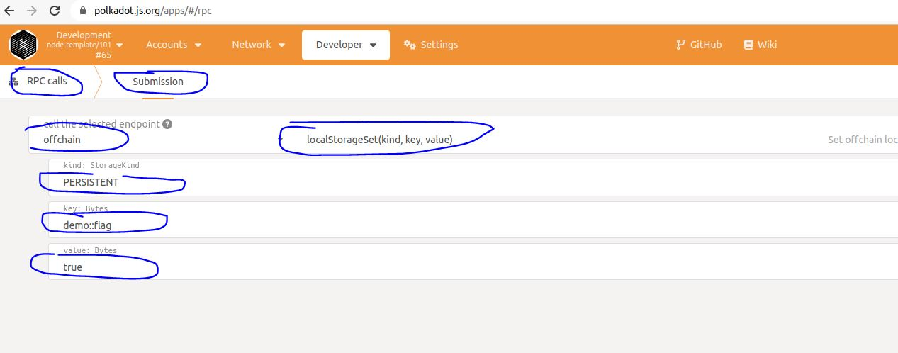
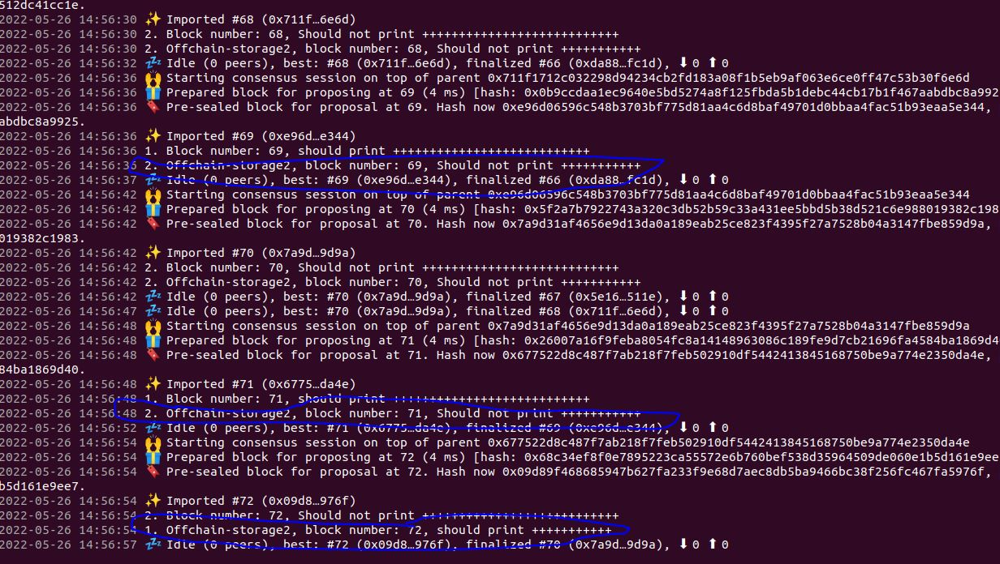

# 在pallet中使用链下存储

前面我们已经讲解了在offchain worker中提交交易到链上的例子，包括签名交易、未签名交易、具有签名payload的未签名交易三种情况。实际上，在ocw（offchain worker）中除了可以提交交易以外，我们还可以使用链下存储。顾名思义，链下存储不保存在链上，而是保存在节点本地的。

本节，我们就在pallet中使用链下存储。

# 1 在ocw中使用StorageValueRef
## 1.1 示例实现
在ocw中可以使用具体StorageValueRef，其详细的文档在[这里](https://paritytech.github.io/substrate/master/sp_runtime/offchain/storage/struct.StorageValueRef.html)，下面我们就实现一个在ocw中使用StorageValueRef的例子，如下：
```
#![cfg_attr(not(feature = "std"), no_std)]

pub use pallet::*;
#[frame_support::pallet]
pub mod pallet {
	use frame_support::pallet_prelude::*;
	use frame_system::pallet_prelude::*;

	use sp_runtime::offchain::storage::{
		MutateStorageError, StorageRetrievalError, StorageValueRef,
	};

	#[pallet::pallet]
	#[pallet::generate_store(pub(super) trait Store)]
	pub struct Pallet<T>(_);

	#[pallet::config]
	pub trait Config: frame_system::Config {}

	#[pallet::hooks]
	impl<T: Config> Hooks<BlockNumberFor<T>> for Pallet<T> {
		fn offchain_worker(block_number: T::BlockNumber) {
			if Self::should_print() {
				log::info!(target:"offchain-storage", "1. Block number: {:?}, should print +++++++++++++++++++++++++++ ", block_number);
			} else {
				log::info!(target:"offchain-storage", "2. Block number: {:?}, Should not print +++++++++++++++++++++++++++ ", block_number);
			}
		}
	}

	impl<T: Config> Pallet<T> {
		fn should_print() -> bool {
			const LAST_VALUE: () = ();
      
      //重点看这里
			let val = StorageValueRef::persistent(b"ocw-demo::last_value");
			let res =
				val.mutate(
					|last_flag: Result<Option<bool>, StorageRetrievalError>| match last_flag {
						Ok(Some(flag)) => Ok(!flag),
						_ => Ok(true),
					},
				);

			match res {
				Ok(flag) => flag,
				Err(MutateStorageError::ValueFunctionFailed(LAST_VALUE)) => false,
				Err(MutateStorageError::ConcurrentModification(_)) => false,
			}
		}
	}
}
```
在上面的例子中，我们定义了一个叫做ocw-demo::last_value的链下storage，然后在不同的区块高度将此storage的值设置成true或者false。

## 1.2 测试
将上面的代码实现后编译测试，会发现在terminal上会交替的打印如下log：



# 2 在ocw中使用local_storage_set/get
下面我们在看一个使用local_storage_set和local_storage_get的例子，在这个例子中，我们手动通过rpc对storage demo::flag设置为true，然后在代码中查看此存储的值，然后再将此值写到另外一个存储demo::result中，具体代码如下：
```
#![cfg_attr(not(feature = "std"), no_std)]

pub use pallet::*;
#[frame_support::pallet]
pub mod pallet {
	use frame_support::pallet_prelude::*;
	use frame_system::pallet_prelude::*;

	extern crate alloc;
	use alloc::string::{String, ToString};

	#[pallet::pallet]
	#[pallet::generate_store(pub(super) trait Store)]
	pub struct Pallet<T>(_);

	#[pallet::config]
	pub trait Config: frame_system::Config {}

	#[pallet::hooks]
	impl<T: Config> Hooks<BlockNumberFor<T>> for Pallet<T> {
		fn offchain_worker(block_number: T::BlockNumber) {
			let flag = Self::should_print();

			if flag {
				log::info!(target:"offchain-storage2222", "1. Offchain-storage2, block number: {:?}, should print +++++++++++ ", block_number);
			} else {
				log::info!(target:"offchain-storage2222", "2. Offchain-storage2, block number: {:?}, Should not print +++++++++++ ", block_number);
			}

			Self::set_result(flag);
		}
	}

	impl<T: Config> Pallet<T> {
		fn should_print() -> bool {
			let kind = sp_core::offchain::StorageKind::PERSISTENT;
			if let Some(flag) = sp_io::offchain::local_storage_get(kind, b"demo::flag") {
				let ret = match String::from_utf8(flag) {
					Ok(v) => v.eq(&"true"),
					Err(_) => false,
				};

				ret
			} else {
				false
			}
		}

		fn set_result(flag: bool) {
			let kind = sp_core::offchain::StorageKind::PERSISTENT;
			let value = match flag {
				true => "true".to_string(),
				false => "false".to_string(),
			};
			sp_io::offchain::local_storage_set(kind, b"demo::result", value.as_bytes());
		}
	}
}
```
## 2.2 测试
这里我们手动设置local storage需要用polkadot-js-app，然后将对应的storage的值设置为true，如下：


设置后运行的结果如下：


# 3 完整源码地址

https://github.com/anonymousGiga/learn-substrate-easy-source/tree/main/substrate-node-template/pallets/offchain-storage

https://github.com/anonymousGiga/learn-substrate-easy-source/tree/main/substrate-node-template/pallets/offchain-storage2


