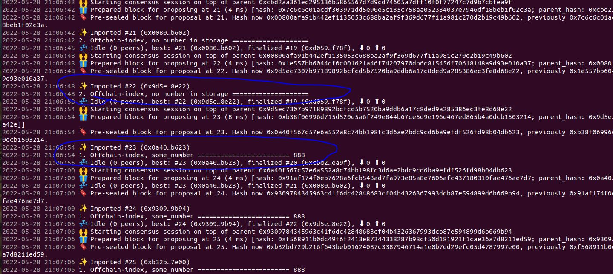

# 使用offchain_index

前面我们已经介绍了在ocw中使用链下存储，它的所有的使用都是在链下进行的（准确的说是在ocw中进行的）。今天我们来介绍offchain_index。和在ocw中使用链下存储不同，offchain_index提供的是在链上操作链下存储的方式。

# 1 pallet实现
本示例的具体功能就是提供一个调度函数，在该调度函数中通过offchain_index设置链下存储，然后我们在ocw中将该链下存储的值打印出来。整体代码如下：
```
#![cfg_attr(not(feature = "std"), no_std)]

pub use pallet::*;
#[frame_support::pallet]
pub mod pallet {
	use frame_support::pallet_prelude::*;
	use frame_system::pallet_prelude::*;
	use scale_info::prelude::vec::Vec;

	use sp_runtime::offchain::storage::StorageValueRef;

	#[pallet::pallet]
	#[pallet::generate_store(pub(super) trait Store)]
	pub struct Pallet<T>(_);

	#[pallet::config]
	pub trait Config: frame_system::Config {}

	#[pallet::hooks]
	impl<T: Config> Hooks<BlockNumberFor<T>> for Pallet<T> {
		fn offchain_worker(_block_number: T::BlockNumber) {
			if let Ok(some_number) = Self::get_local_storage() {
				log::info!(target:"offchain-index-demo", "1. Offchain-index, some_number ======================== {:?}", some_number);
			} else {
				log::info!(target:"offchain-index-demo", "2. Offchain-index, no number in storage ==================== ");
			}
		}
	}

	#[pallet::call]
	impl<T: Config> Pallet<T> {
		#[pallet::weight(0)]
		pub fn set_local_storage(
			origin: OriginFor<T>,
			some_number: u32,
		) -> DispatchResultWithPostInfo {
			ensure_signed(origin)?;

			Self::set_local_storage_with_offchain_index(some_number);
			Ok(().into())
		}
	}

	impl<T: Config> Pallet<T> {
		fn derived_key() -> Vec<u8> {
			b"offchain-index-demo::value".encode()
		}
    
    // 重点1：看这里，这里是通过offchain_index将值设置到链下存储，请注意key的值
		fn set_local_storage_with_offchain_index(some_number: u32) {
			let key = Self::derived_key();
			sp_io::offchain_index::set(&key, some_number.encode().as_slice());
			log::info!(target:"offchain-index-demo", "set some_number ======================== {:?}", some_number);
		}

    // 重点2：看这里，这里是从对应的链下存储读取，请注意key的值
		fn get_local_storage() -> Result<u32, &'static str> {
			let key = Self::derived_key();
			let some_number_storage = StorageValueRef::persistent(&key);

			if let Ok(Some(number)) = some_number_storage.get::<u32>() {
				Ok(number)
			} else {
				Err("No number in storage.")
			}
		}
	}
}
```

# 2 测试
## 2.1 编译&运行

将pallet的代码实现好后，然后在runtime中加入该pallet（由于这部分我们之前讲过很多次，所以此处就不累述了），接下来就是编译测试了。

* 编译
```
cargo build
```
* 运行

**此处运行要特别注意，需要加上--enable-offchain-indexing=true, 否则offchain-index功能不会打开**
```
./target/debug/node-template --dev --enable-offchain-indexing=true
```

## 2.2 测试结果

我们将节点启动后，打开polkadot-js-app，然后按下图操作：


然后我们再可以看到打印日志的对比情况：



# 3 完整源码地址

https://github.com/anonymousGiga/learn-substrate-easy-source/tree/main/substrate-node-template/pallets/offchain-index


