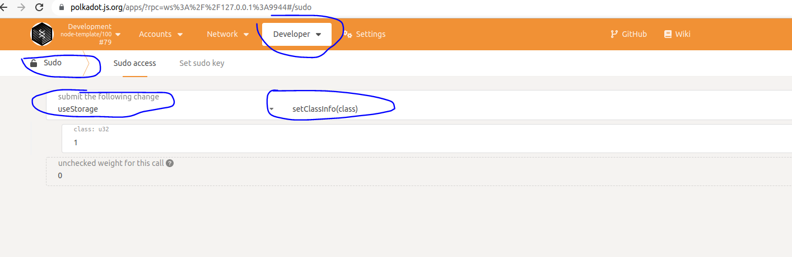
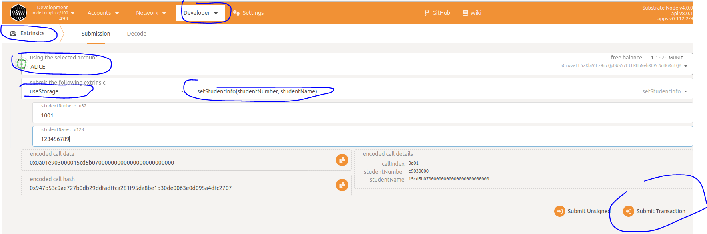
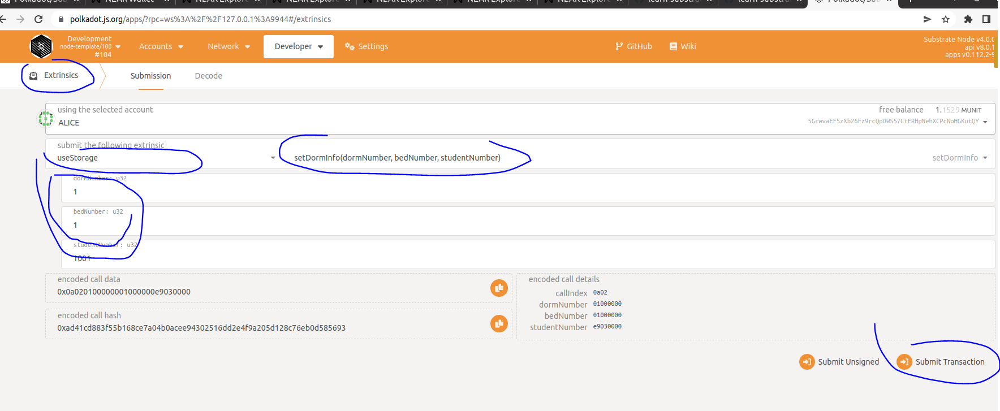
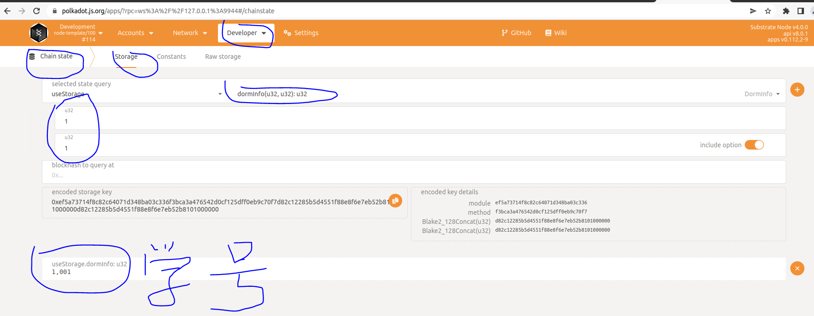

# storage使用介绍

最开始的时候本来没准备介绍这一章节，觉得storage直接看官方文档就好，但是和身边的小伙伴交流，觉得还是应该讲一下，毕竟这部分是在pallet时经常会使用到的部分。

首先我们来讲讲对storage的理解。第一次接触substrate的时候，和容易让人把storage和其它区块链架构中的storage（持久化存储）混淆。在其它的区块链中，如ethereum或者bitcoin中，节点对区块链相关的数据使用leveldb这样的数据库进行持久化存储，substrate中也有些持久化存储。但是，这些持久化存储不是我们本节要说的我们在pallet中使用的storage。**在pallet中要使用的storage更多的其实是一个应用层的概念**，如果用城市建造来类比，持久化存储就像是整个城市的马路或者是管道，而我们谈论的storage则是某个具体建筑或者房屋里面的水管会小路，至于这些小水管（或小路）是怎么和整个城市的大路联系起来的，不是我们讨论的范围。

# 1 storage的使用方式
前面我们在pallet的组成中介绍过storage的使用方式，但是这里我们既然是重新来讲这部分，那肯定要讲的深入一点。这里我们把[substrate官方文档](https://docs.substrate.io/rustdocs/latest/frame_support/attr.pallet.html#storage-palletstorage-optional)中的使用方式拿过来，然后逐个讲解：
```
1 #[pallet::storage]
2 #[pallet::getter(fn $getter_name)] // optional
3 $vis type $StorageName<$some_generic> $optional_where_clause
4	  = $StorageType<$generic_name = $some_generics, $other_name = $some_other, ...>;
```
上面这几行代码是官方文档中告诉我们如何在pallet中定义storage的代码，为了方便讲解，我加上了行号。

* 第一行，```#[pallet::storage]```是定义的storage时的固定写法，表示下面定义了一个storage。在定义storage时，无论你怎么使用，都必须写这一行。
* 第二行，```#[pallet::getter(fn $getter_name)]```，在有些定义storage时会使用这一行，有些不会。这一行的意思是自动为下面定义的storage生成一个getter函数，函数的名字就是$getter_name。例如我定义如下的storage：
	```
	#[pallet::storage]
	#[pallet::getter(fn my_id)]
	pub type MyId<T: Config> = StorageValue<_, u8, ValueQuery>;
	```
	
        这里我定义了一个存储MyId，就自动为其生成了getter函数，函数名字是my_id，后续可以在pallet使用my_id()函数来获取该Storage中存储的值。
* 第三行和第四行就是真正定义Storage。定义的格式一定是$vis type开头（其中$vis是public、或者无这些范围修饰符，也就是表示其在代码中的使用范围）。接下来的$StorageName就是存储的名字，然后紧接着的尖括号中的$some_generic是泛型类型，而$optional_where_clause是对应泛型类型的约束。所以，上面那个例子我们也可以定义成这样：
	```
	#[pallet::storage]
	#[pallet::getter(fn my_id)]
	pub type MyId<T> where T: Config = StorageValue<_, u8, ValueQuery>;
	```
   这里我们使用了ValueQuery，表示为查询值实现了QueryKindTrait，具体的此处不展开，可以[查阅文档]（https://paritytech.github.io/substrate/master/frame_support/storage/types/struct.ValueQuery.html）。
* 而第四行中的$StorageType则是具体的storage类型（也就是StorageValue\StorageMap\StorageDoubleMap\StorageNMap中的一种），接着的尖括号中的第一个参数```$generic_name = $some_generics```主要用来生产storage的前缀（有兴趣的小伙伴可以深入研究下，可能和底层存储有关），在具体使用中一般都使用```_```即可,尖括号中从第二个参数起，就和具体的Storage类型相关，需要参见具体的Storage类型。

# 2 使用示例
下面我们就来用一个例子演示一下各种存储。我们假定有这样一个应用，记录某个年纪各个寝室每个床位的学生姓名，我们将分别使用StorageValue\StorageMap\StorageDoubleMap几种存储类型。在此例子中，我们将重新写一个pallet，其过程和前面我们讲到的实现简单的pallet中的过程一样，后续我们的示例也都是这样的过程。本节我们还是复习一下创建pallet以及加载的过程，但是在后面的例子中，如非必要，我们将只写pallet部分的代码，在runtime中使用pallet我们将不重复赘述。

## 2.1 创建pallet
我们还是在之前的substrate-node-template中进行。

* 拷贝template，过程如下：
    ```
    cd 上层路径/substrate-node-template/pallets
    cp template use-storage -rf
    ```
* 修改pallet包名，打开substrate-node-template/pallets/use-storage/Cargo.toml文件，修改如下内容：
    ```
    [package]
    name = "pallet-use-storage"    #修改此行
    ...
    
    ```
* 添加模板
  
  接下来我们将substrate-node-template/pallets/use-storage/src/lib.rs中的内容完全删掉，然后拷贝[模板](https://docs.substrate.io/v3/runtime/frame/)到这个文件中。
## 2.2 编写pallet中的逻辑
  然后我们在pallet中定义三个存储，分别用来存储班级、学生、寝室的信息，分别如下：
  ```
  	// 4. Runtime Storage
	// use storageValue store class.
	#[pallet::storage]
	#[pallet::getter(fn my_class)]
	pub type Class<T: Config> = StorageValue<_, u32>;

	// use storageMap store (student number -> student name).
	#[pallet::storage]
	#[pallet::getter(fn students_info)]
	pub type StudentsInfo<T: Config> = StorageMap<_, Blake2_128Concat, u32, u128, ValueQuery>;

	#[pallet::storage]
	#[pallet::getter(fn dorm_info)]
	pub type DormInfo<T: Config> = StorageDoubleMap<
		_,
		Blake2_128Concat,
		u32, //dorm number
		Blake2_128Concat,
		u32, //bed number
		u32, // student number
		ValueQuery,
	>;
  ```
  * Class存储班级编号，需要root权限才能设置，使用StorageValue存储;
  * StudentsInfo存储学生的学号和姓名的对应关系，使用StorageMap存储;
  * DormInfo存储寝室号、床号、学号之间的对应关系，使用StorageDoubleMap存储。
  
  另外我们定义了设置这些信息成功后对应的Event，分别如下：
  ```
  	// 5. Runtime Events
	// Can stringify event types to metadata.
	#[pallet::event]
	#[pallet::generate_deposit(pub(super) fn deposit_event)]
	pub enum Event<T: Config> {
		SetClass(u32),
		SetStudentInfo(u32, u128),
		SetDormInfo(u32, u32, u32),
	}
  ```
  
  所有的设置信息的交易函数实现如系：
  ```
#[pallet::weight(0)]
pub fn set_class_info(origin: OriginFor<T>, class: u32) -> DispatchResultWithPostInfo {
	ensure_root(origin)?;

	Class::<T>::put(class);
	Self::deposit_event(Event::SetClass(class));
	
	Ok(().into())
}

#[pallet::weight(0)]
pub fn set_student_info(
	origin: OriginFor<T>,
	student_number: u32,
	student_name: u128,
) -> DispatchResultWithPostInfo {
	ensure_signed(origin)?;

	StudentsInfo::<T>::insert(&student_number, &student_name);
	Self::deposit_event(Event::SetStudentInfo(student_number, student_name));

	Ok(().into())
}

#[pallet::weight(0)]
pub fn set_dorm_info(
	origin: OriginFor<T>,
	dorm_number: u32,
	bed_number: u32,
	student_number: u32,
) -> DispatchResultWithPostInfo {
	ensure_signed(origin)?;

	DormInfo::<T>::insert(&dorm_number, &bed_number, &student_number);
	Self::deposit_event(Event::SetDormInfo(dorm_number, bed_number, student_number));

	Ok(().into())
}
  ```

基本上都是判断发起交易者的权限，然后设置信息、发出事件这样的过程，整个pallet完整的代码可以参考[这里](https://github.com/anonymousGiga/learn-substrate-easy-source/blob/main/substrate-node-template/pallets/use-storage/src/lib.rs).

## 2.3 在runtime中使用

写完pallet后，我们就可以将pallet添加到runtime中。

* 添加依赖，在substrate-node-template/runtime/Cargo.toml中添加如下代码：
```
[dependencies]
...
#添加下面这行
pallet-use-storage = { 
	version = "4.0.0-dev", 
	default-features = false, 
	path = "../pallets/use-storage" 
}
...

[features]
default = ["std"]
std = [
	"codec/std",
	...
	#添加下面这行
	"pallet-use-storage/std", 
	...
	]
```

* 修改runtime/src/lib.rs，添加如下代码：
```
...
impl pallet_use_storage::Config for Runtime {
	type Event = Event;
}
...

construct_runtime!(
	pub enum Runtime where
		Block = Block,
		NodeBlock = opaque::Block,
		UncheckedExtrinsic = UncheckedExtrinsic
	{
		System: frame_system,
		...
		TemplateModule: pallet_template,
		SimplePallet: pallet_simple_pallet,
		//添加下面这行
		UseStorage: pallet_use_storage,
	}
);

```

## 2.4 编译&运行

回到substrate-node-template目录，执行如下编译：
```
cargo build
```

启动节点：
```
./target/debug/node-template --dev
```

## 2.5 使用前端进行交互

我们可以用polkadot-js-app进行交互，在浏览器中输入https://polkadot.js.org/apps/?rpc=ws%3A%2F%2F127.0.0.1%3A9944#

然后设置的操作分别如下图：




查询寝室信息的操作如下图：


小伙伴们可以再查一下学生信息和班级信息。


# 3 参考文档

https://docs.substrate.io/rustdocs/latest/frame_support/attr.pallet.html#storage-palletstorage-optional

https://paritytech.github.io/substrate/master/frame_support/storage/types/index.html

https://paritytech.github.io/substrate/master/frame_support/storage/types/struct.ValueQuery.html

# 4 示例完整代码

https://github.com/anonymousGiga/learn-substrate-easy-source/tree/main/substrate-node-template/pallets/use-storage

