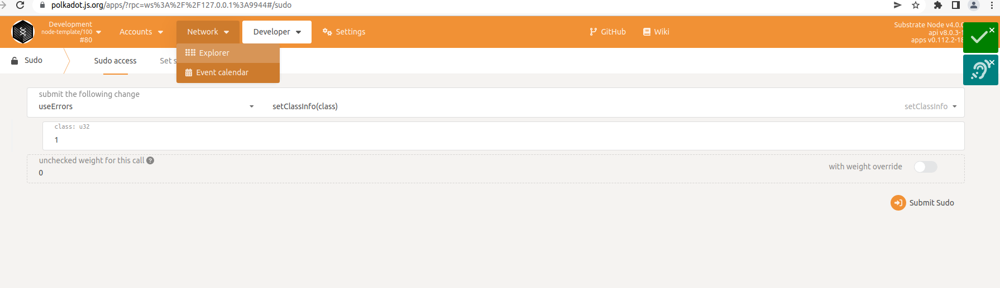
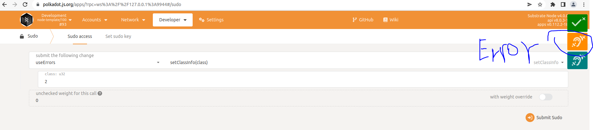
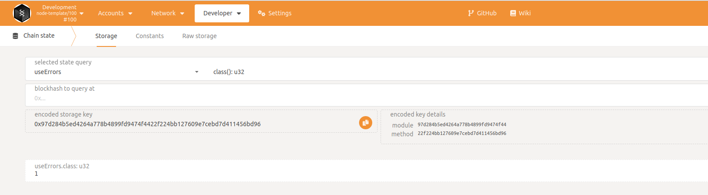

# Error类型的使用

在前面的讲解写简单的pallet中，我们提到了写pallet的模板，在模板中我们分了大概7个部分。不过这其实只是写pallet的常见的部分，除了这7个部分，实际上还有Error类型我们没有说明。在runtime代码执行时，代码必须是“非抛出的”，或者说不应该panic，应该是优雅的处理错误，所以在写pallet代码时，允许我们自定义错误类型，当错误发生时，可以返回我们定义的错误类型。这里的Error类型是指运行时在执行调度函数（也就是交易函数）时返回的错误。因为在调度函数执行时，返回的结果为DispatchResult类型，当执行结果错误时，返回DispatchError。

# 1 错误类型的定义
和之前我们讲过的Event一样，Error是一个枚举类型，其定义方式如下：
```
#[pallet::error]
pub enum Error<T> {
    //错误类型1
    InvalidParameter,
    //错误类型2
    OutOfSpace,
    ...
    //错误类型3
    InvalidFee,
}
```
可以看到，定义Error类型时，上面是```#[pallet::error]```宏，然后就是Error枚举类型。

# 2 在函数中返回错误
在函数中返回错误的情况，通常如下：
```
pub fn xx_function(origin: OriginFor<T>, ...) 
    -> DispatchResultWithPostInfo {
		...
		if 返回错误条件成立 {
			return Error::<T>::错误类型
		}
		...
		Ok(().into())
}

```
上面是伪代码，具体的我们可以看下面的完整示例。

# 3 简单示例
接下来我们创建一个use-erros的pallet，在其中演示使用Errors类型。为了方便期间，我们直接拷贝之前实现过的use-storage目录，然后将目录名字修改为use-errors，将Cargo.toml中的包名修改为pallet-use-errors。

然后我们修改substrate-node-template/pallets/use-errors/src/lib.rs文件，首先是添加Error类型的定义：
```
#[pallet::error] 
pub enum Error<T> {
    // Class 只允许设置一次
    SetClassDuplicate,
    // 相同学号的只允许设置一次名字
    SetStudentsInfoDuplicate,
    // 相同床位只允许设置一次
    SetDormInfoDuplicate,
}
```
接下来是修改调度函数set_class_info如下：
```
#[pallet::weight(0)]
pub fn set_class_info(origin: OriginFor<T>, class: u32) 
	-> DispatchResultWithPostInfo {
    ensure_root(origin)?;
    //添加下面的三行，使用Error类型
    if Class::<T>::exists() {
        return Err(Error::<T>::SetClassDuplicate.into())
    }

    Class::<T>::put(class);
    ...			
}
```
修改调度函数set_student_info如下：
```
#[pallet::weight(0)]
pub fn set_student_info(
        origin: OriginFor<T>,
        student_number: u32,
        student_name: u128,
) -> DispatchResultWithPostInfo {
        ensure_signed(origin)?;
	//添加如下三行，使用Error类型
        if StudentsInfo::<T>::contains_key(student_number) {
                return Err(Error::<T>::SetStudentsInfoDuplicate.into())
        }
	...
}

```
修改调度函数set_dorm_info如下：
```
#[pallet::weight(0)]
pub fn set_dorm_info(
        origin: OriginFor<T>,
        dorm_number: u32,
        bed_number: u32,
        student_number: u32,
) -> DispatchResultWithPostInfo {
        ensure_signed(origin)?;
	//添加如下三行，使用Error类型
        if DormInfo::<T>::contains_key(dorm_number, bed_number) {
                return Err(Error::<T>::SetDormInfoDuplicate.into())
        }
	...
}

```
我们分别在我们之前的函数中使用了Error类型，当满足错误判断条件时，会返回对应的error

当pallet写好后，我们需要继续修改substrate-node-template/runtime/Cargo.toml和substrate-node-template/runtime/lib.rs，将我们的use-errors pallet添加到runtime中，因为这个步骤我们在前面simple-pallet和use-storage pallet中演示了几遍，所以此处不重复了。不会的小伙伴可以翻前面的示例，另外本节完整的代码地址也会在末尾给出。

修改好代码后，可以执行如下代码编译：
```
cargo build
```

然后启动节点：
```
./target/debug/node-template --dev
```

# 4 测试
接下来我们使用polkadot-js-app来测试，在浏览器输入https://polkadot.js.org/apps/， 然后选择链接localnode，调用对应的函数。
此处我们只测试set_class_info函数，set_student_info和set_dorm_info小伙伴们可以自行测试。set_class_info的测试步骤如下：
* 我们调用set_class_info，设置class为1,此时应该设置成功，通过chainstate查看，可以看到class为1
* 再次调用set_class_info，设置class为2,会发现调用报错，浏览器右上角返回错误为```SetClassDuplicate```




此处可以把右上角的黄色的错误点开，可以看到错误是```SetClassDuplicate```。




# 5 参考文档

https://docs.substrate.io/v3/runtime/events-and-errors/

# 6 完整代码

https://github.com/anonymousGiga/learn-substrate-easy-source/blob/main/substrate-node-template/pallets/use-errors/src/lib.rs
