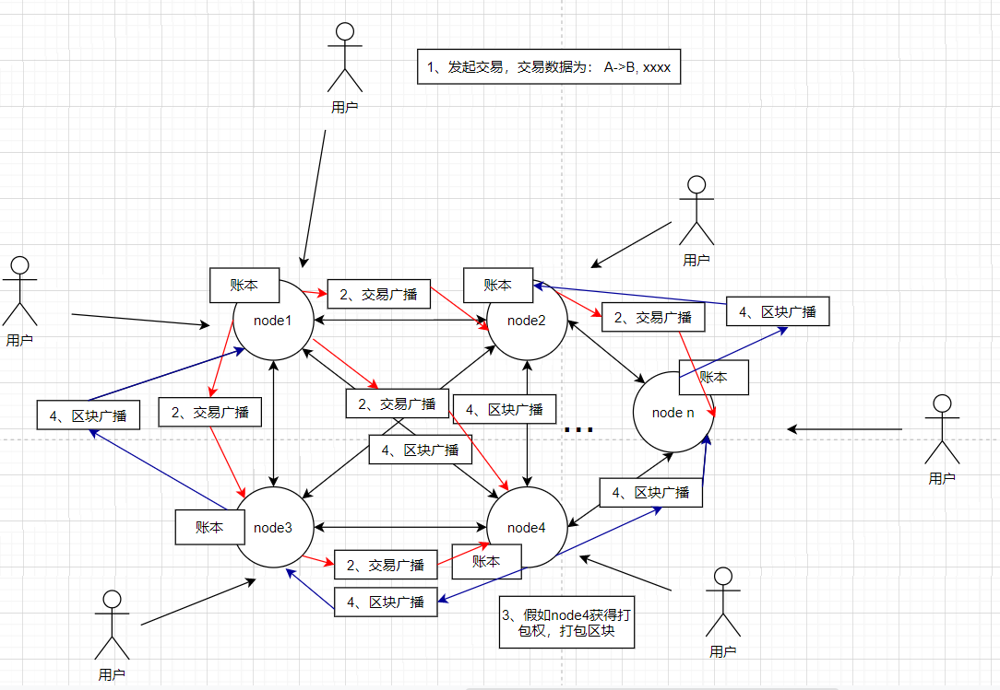

# 钩子函数的使用

# 1 背景知识
## 1.1 交易到打包的过程
在这个教程中，我其实一直回避原理性的知识，因为感觉讲太多原理性的东西会让入门变得更难。但是当准备讲hooks的时候，发现必须得讲讲区块链打包记账的过程，否则就不好理解。所以这里画了一张区块链运行的示意图，如下：




图中描述了交易产生到打包成到区块中，最后每个节点接受区块存储到本地的全过程，这里我们简单描述下过程：
```
1、用户通过钱包发起交易;
2、和钱包相连的全节点收到交易后会把交易广播到网络中;
3、然后根据共识算法打包区块，某个全节点获得了打包权（图中画的是节点4），然后将交易打包到区块中;
4、打包好区块后，将区块广播到网络中;
5、其它每个节点收到区块后验证，然后执行区块里面的交易，更新自己本地的账本。
```


## 1.2 substrate中的执行过程
上面我们讲了区块链系统的打包的过程，下面我们再讲讲substrate中具体的区块执行的过程（上面的第5步）。在substrate中区块执行主要分为三步，分别是：
* 初始化区块（Initializes the block）;
* 执行区块（Executes extrinsics）;
* 确认区块（Finalizes the block）.

### 1.2.1 初始化区块
初始化区块时就会执行所有pallet（就是construct_runtime!中包含的pallet，并且也是按照construct_runtime!中定义的顺序）的on_initialize函数，不过会最先执行System模块的（frame-system）.

### 1.2.2 执行交易

区块初始化后，就会根据交易（extrinsics）列表的顺序执行。

### 1.2.3 确认区块
区块中的交易执行完后，确认区块。确认区块时会调用所有pallet（就是construct_runtime!中包含的pallet，并且也是按照construct_runtime!中定义的顺序）的on_idle和on_finalize函数，不过这次最后执行System模块（frame-system）的hooks函数.
  
# 2 hooks介绍 
```
pub trait Hooks<BlockNumber> {
    fn on_finalize(_n: BlockNumber) { ... }
    fn on_idle(_n: BlockNumber, _remaining_weight: Weight) -> Weight { ... }
    fn on_initialize(_n: BlockNumber) -> Weight { ... }
    fn on_runtime_upgrade() -> Weight { ... }
    fn pre_upgrade() -> Result<(), &'static str> { ... }
    fn post_upgrade() -> Result<(), &'static str> { ... }
    fn offchain_worker(_n: BlockNumber) { ... }
    fn integrity_test() { ... }
}
```
每个钩子函数在对应的时间自动调用执行，开发者可以根据需要在这些钩子函数中添加业务逻辑。

* on_finalize: 在区块finalize的时候调用。
* on_idle：区块finalize的时候调用，不过比on_finalize先调用。
* on_initialize：区块初始化的时候调用。
* on_runtime_upgrade：执行模块升级的时候调用。
* pre_upgrade：升级之前的检查。
* post_upgrade：升级之后的处理。
* offchain_worker：在一个pallet上实现此函数后可以在此函数中长时间的执行需要链下执行的功能。该函数会在每次区块导入的时候调用。后续我们将ocw使用的时候就需要和这个函数打交道。
* integrity_test：运行集成测试。

# 3 示例
下面我们就写一个使用```on_initialize```和```on_finalize```的例子。同样的，我们之前的例子ext-example上进行修改。
```
cd substrate-node-template/pallets
cp ext-example use-hooks -rf
```
然后进入use-hooks目录，修改Cargo.toml中的包名为pallet-use-hooks，同时添加log的依赖，如下：
```
[dependencies]
...
log = { version = "0.4.14", default-features = false }  #添加这个依赖
```

接下来在use-hooks/src/lib.rs中添加如下代码：
```
// 6. Hooks
// 添加hooks函数 
#[pallet::hooks]
impl<T: Config> Hooks<BlockNumberFor<T>> for Pallet<T> { 
		fn on_initialize(n: BlockNumberFor<T>) -> Weight {
			log::info!(target: "use-hooks", 
      "++++++++++++ on_initialize, block number is {:?}", n);
			0
		}

		fn on_finalize(n: BlockNumberFor<T>) {
			log::info!(target: "use-hooks", 
      "------------ on_finalize, block number is {:?}", n);
		}
}
```
然后在我们修改函数set_param_bigger_than_100，在其中添加一行log，如下：
```
#[transactional]
#[pallet::weight(0)]
pub fn set_param_bigger_than_100(origin: OriginFor<T>, param: u32) 
    -> DispatchResult {
    ...

		//3、发出事件
		Self::deposit_event(Event::SetParam(param));
    //添加log
		log::info!(target: "use-hooks", "set param bigger then 100");  

		Ok(().into())
}
```

接下来就可以将use-hooks pallet添加到runtime中，因为这个步骤我们在前面simple-pallet和use-storage pallet中演示了几遍，所以此处不重复了。不会的小伙伴可以翻前面的示例，另外本节完整的代码地址也会在末尾给出。

# 4 交互
编译：
```
cargo build
```
执行：
```
./target/debug/node-template --dev
```

然后此时，我们可以看下打印的日志，可以清楚的看到我们在on_initialize和on_finalize中的打印，如下图：


# 5 参考文档

# 6 完整源码
