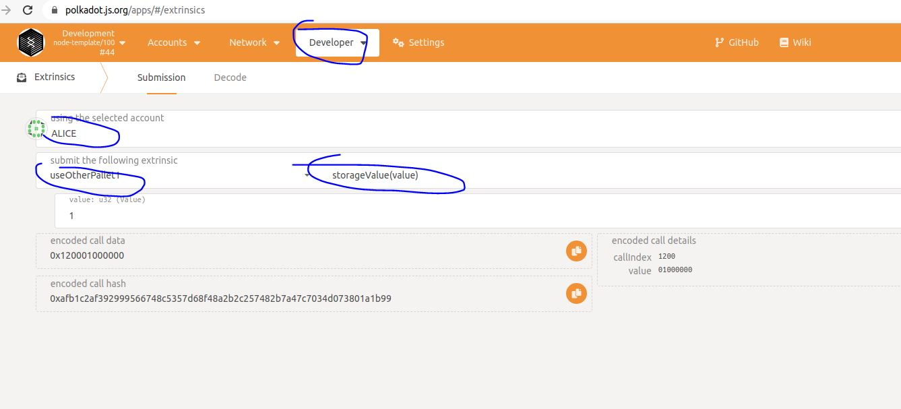

# 在pallet中使用其它pallet

本节，我们讲讲如何在自己的pallet中使用其它的pallet。在自己的pallet中使用其它的pallet主要有以下几种情况：
* 在pallet的config中定义类型，然后runtime中使用时指定这个类型为frame中指定某个现成的pallet；
* 在pallet的config中定义类型，然后runtime中使用时指定这个类型为frame中指定某个自定义的pallet；
* 封装和扩展现有的pallet。

本节主要介绍前两种方式，实际上第一种和第二种是同样的方式，但是我们这里分成两种情况介绍。

# 1 在runtime中直接指定某个类型为其它的pallet
在上一节中我们讲解了pallet的config中定义类型，然后在runtime中指定具体的类型。此处讲的第一种使用其它pallet就是这种方式。这种方式比较常见的就是在pallet中定义currency类型，然后用指定currency类型为balances pallet。详细的可以看substrate中node中的使用，在pallet_assets中使用了pallet_balances，就是通过指定前者的currency类型为后者（详情见：https://github.com/paritytech/substrate/blob/master/bin/node/runtime/src/lib.rs#L1343） 。

# 2 pallet中使用其它pallet的storage
下面我们在自定义两个pallet，分别叫做pallet-use-other-pallet1和pallet-storage-provider，然后我们在前一个pallet中读取和存储后一个pallet，下面我们看具体实现。整个部分完整的代码可以参考[这里](https://github.com/anonymousGiga/learn-substrate-easy-source/tree/main/substrate-node-template/pallets)(本节对应的pallet是storage-provider和use-other-pallet1)。

## 2.1 pallet-storage-provider实现
学过之前的知识我们知道，pallet的config中的类型定义实际上一种trait约束，就是对应的类型需要实现冒号后的trait。为了方便演示，我们定义如下trait：
```
pub trait StorageInterface{
	type Value;
	fn get_param() -> Self::Value;
	fn set_param(v: Self::Value);
}
```
这个trait可以单独定义在某个包中。这里我们为了方便，直接放在pallet-storage-provider对应的文件夹中。下面我们在看看pallet-storage-provider/src/lib.rs的代码，如下：
```
#![cfg_attr(not(feature = "std"), no_std)]

pub use pallet::*;
pub use traits::StorageInterface;

pub mod traits;

#[frame_support::pallet]
pub mod pallet {
	use codec::Codec;
	use frame_support::{
		pallet_prelude::*, sp_runtime::traits::AtLeast32BitUnsigned, sp_std::fmt::Debug,
	};
	use frame_system::pallet_prelude::*;

	#[pallet::pallet]
	#[pallet::generate_store(pub(super) trait Store)]
	pub struct Pallet<T>(_);

	#[pallet::config]
	pub trait Config: frame_system::Config {
		type Event: From<Event<Self>> + IsType<<Self as frame_system::Config>::Event>;
		type Value: Member
			+ Parameter
			+ AtLeast32BitUnsigned
			+ Codec
			+ From<u32>
			+ Into<u32>
			+ Copy
			+ Debug
			+ Default
			+ MaxEncodedLen
			+ MaybeSerializeDeserialize;
	}

	#[pallet::storage]
	pub type MyValue<T: Config> = StorageValue<_, T::Value, ValueQuery>;

	#[pallet::event]
	#[pallet::generate_deposit(pub(super) fn deposit_event)]
	pub enum Event<T: Config> {
		FunctionCall,
	}

	#[pallet::call]
	impl<T: Config> Pallet<T> {
		#[pallet::weight(0)]
		pub fn my_function(
			origin: OriginFor<T>,
		) -> DispatchResultWithPostInfo {
			ensure_signed(origin)?;
			log::info!(target: "storage provider", "my function!");
			Self::deposit_event(Event::FunctionCall);

			Ok(().into())
		}
	}
}

// 注意此处：我们为pallet实现了前面定义的trait StorageInterface.
impl<T: Config> StorageInterface for Pallet<T> {
	type Value = T::Value;

	fn get_param() -> Self::Value {
		MyValue::<T>::get()
	}

	fn set_param(v: Self::Value) {
		MyValue::<T>::put(v);
	}
}

```

## 2.2 pallet-use-other-pallet1
下面我们在看pallet-use-other-pallet1的代码：
```
#![cfg_attr(not(feature = "std"), no_std)]

pub use pallet::*;

#[frame_support::pallet]
pub mod pallet {
	use codec::Codec;
	use frame_support::{
		pallet_prelude::*, sp_runtime::traits::AtLeast32BitUnsigned, sp_std::fmt::Debug,
	};
	use frame_system::pallet_prelude::*;
	use pallet_storage_provider::traits::StorageInterface;

	#[pallet::pallet]
	#[pallet::generate_store(pub(super) trait Store)]
	pub struct Pallet<T>(_);

	// 3. Runtime Configuration Trait
	#[pallet::config]
	pub trait Config: frame_system::Config {
		type Event: From<Event<Self>> + IsType<<Self as frame_system::Config>::Event>;
		type Value: Member
			+ Parameter
			+ AtLeast32BitUnsigned
			+ Codec
			+ From<u32>
			+ Into<u32>
			+ Copy
			+ Debug
			+ Default
			+ MaxEncodedLen
			+ MaybeSerializeDeserialize;
  
  //定义了MyStorage类型，要求其实现trait StorageInterface
		type MyStorage: StorageInterface<Value = Self::Value>; 
	}

	// 5. Runtime Events
	// Can stringify event types to metadata.
	#[pallet::event]
	#[pallet::generate_deposit(pub(super) fn deposit_event)]
	pub enum Event<T: Config> {
		StoreEvent,
	}

	// 7. Extrinsics
	// Functions that are callable from outside the runtime.
	#[pallet::call]
	impl<T: Config> Pallet<T> {
		#[pallet::weight(0)]
		pub fn storage_value(
			origin: OriginFor<T>,
			value: T::Value, 
		) -> DispatchResultWithPostInfo {
			ensure_signed(origin)?;

			T::MyStorage::set_param(value);

   //使用trait StorageInterface中的函数
			let v = T::MyStorage::get_param();
			log::info!(target: "other-pallet", "Value get from storage is: {:?}", v);

			Self::deposit_event(Event::StoreEvent);

			Ok(().into())
		}
	}
}
```

## 2.3 在runtime中添加两个pallet
下面就是在runtime中添加对应的pallet。

首先当然添加依赖，在runtime/Cargo.toml中添加：
```
[dependencies]
...
pallet-storage-provider ={ 
      version = "4.0.0-dev", 
      default-features = false, 
      path = "../pallets/storage-provider" }
pallet-use-other-pallet1 = { 
      version = "4.0.0-dev", 
      default-features = false, 
      path = "../pallets/use-other-pallet1" }
 ...
 
[features]
default = ["std"]
std = [
	"codec/std",
	"scale-info/std",
	"frame-executive/std",
	"frame-support/std",
	"frame-system-rpc-runtime-api/std",
	"frame-system/std",
	"pallet-aura/std",
	"pallet-balances/std",
	"pallet-grandpa/std",
	"pallet-randomness-collective-flip/std",
	"pallet-sudo/std",
	"pallet-template/std",
	"pallet-simple-pallet/std",
	"pallet-use-storage/std",
	"pallet-use-errors/std",
	"pallet-ext-example/std",
	"pallet-use-hooks/std",
	"pallet-use-rpc/std",
	"pallet-use-config1/std",
	"pallet-use-config2/std",
	"pallet-storage-provider/std",
	"pallet-use-other-pallet1/std",
...
  ]
  
```
然后在runtime/src/lib.rs中添加如下：
```
//添加下面4行
impl pallet_storage_provider::Config for Runtime {
	type Event = Event;
	type Value = u32;
}

//添加下面5行
impl pallet_use_other_pallet1::Config for Runtime {
	type Event = Event;
	type Value = u32;
	type MyStorage = StorageProvider; 
}

// Create the runtime by composing the FRAME pallets that were previously configured.
construct_runtime!(
	pub enum Runtime where
		Block = Block,
		NodeBlock = opaque::Block,
		UncheckedExtrinsic = UncheckedExtrinsic
	{
		System: frame_system,
  ...
  //添加下面两行
		StorageProvider: pallet_storage_provider, 
		UseOtherPallet1: pallet_use_other_pallet1,
	}
);
```

## 2.4 编译执行
编译命令：
```
cargo build
```
执行命令：
```
./target/debug/node-template --dev
```

## 2.5 使用
在浏览器输入https://polkadot.js.org/apps/#/ ，然后按照下图可以调用pallet_use_other_pallet1中的设置存储函数。



# 3 完整源码地址

https://github.com/anonymousGiga/learn-substrate-easy-source/tree/main/substrate-node-template/pallets/use-other-pallet1

https://github.com/anonymousGiga/learn-substrate-easy-source/tree/main/substrate-node-template/pallets/storage-provider

https://github.com/anonymousGiga/learn-substrate-easy-source/blob/main/substrate-node-template/runtime/src/lib.rs#L308
 
