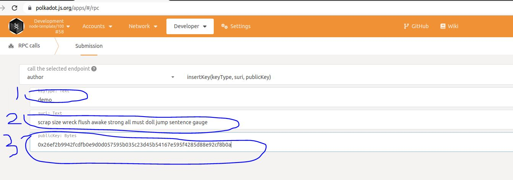

**说明**：此部分的内容相对之前的类容复杂一点，有兴趣的小伙伴可以结合我b站的视频学习，效果会更好。

在区块链的应用中，常见的需求是在把数据上链之前需要去查询链下数据，解决的方式通常是使用预言机，这种方法虽然可行，但在安全性、可伸缩性和基础设施效率方面仍然存在一些缺陷。所以在substrate中为我们提供了一些链下的特性来解决这些需求，分别是：
* 链下工作者（offchain worker）；
* 链下存储（offchain storage）；
* 链下索引（offchain index）。

链下工作者（offchain worker）可以提交签名交易、未签名交易、具有签名负载的未签名交易等功能，本节着重教大家在ocw中使用签名交易的情况。

# 1 在pallet中添加ocw
这个pallet相对于我们以前实现的pallet要复杂一些，因此我们先贴出完整代码，然后再讲解。pallet中的代码如下：
```
#![cfg_attr(not(feature = "std"), no_std)]

//=========================
//需要关注的第一部分
//=========================
use sp_core::crypto::KeyTypeId;
pub const KEY_TYPE: KeyTypeId = KeyTypeId(*b"demo");
pub mod crypto {
	use super::KEY_TYPE;
	use sp_runtime::app_crypto::{app_crypto, sr25519};
	app_crypto!(sr25519, KEY_TYPE);
}
pub type AuthorityId = crypto::Public;
//==========================

pub use pallet::*;
#[frame_support::pallet]
pub mod pallet {
	use frame_support::pallet_prelude::*;
	use frame_system::pallet_prelude::*;

	use frame_system::offchain::{
		AppCrypto, CreateSignedTransaction, SendSignedTransaction, Signer,
	};

	#[pallet::pallet]
	#[pallet::generate_store(pub(super) trait Store)]
	pub struct Pallet<T>(_);

  //=========================
  //需要关注的第二部分
	#[pallet::config]
	pub trait Config: frame_system::Config + CreateSignedTransaction<Call<Self>> {
		type AuthorityId: AppCrypto<Self::Public, Self::Signature>;
		type Event: From<Event<Self>> + IsType<<Self as frame_system::Config>::Event>;
	}
  //=========================

	#[pallet::storage]
	pub type SomeInfo<T: Config> = StorageMap<_, Blake2_128Concat, u64, u64, ValueQuery>;

	#[pallet::event]
	#[pallet::generate_deposit(pub(super) fn deposit_event)]
	pub enum Event<T: Config> {
		SetSomeInfo(u64, u64),
	}

	#[pallet::error]
	pub enum Error<T> {
		OffchainSignedTxError,
		NoAcctForSigning,
	}
  
  //=========================
  //需要关注的第三部分
  //=========================
	#[pallet::hooks]
	impl<T: Config> Hooks<BlockNumberFor<T>> for Pallet<T> {
		fn offchain_worker(block_number: T::BlockNumber) {
			log::info!(target: "ocw", "before offchain_worker set storage: {:?}", block_number);
			let result = Self::offchain_signed_tx(block_number);
			log::info!(target: "ocw", "after offchain_worker set storage: {:?}", block_number);

			if let Err(e) = result {
				log::error!(target:"ocw", "offchain_worker error: {:?}", e);
			}
		}
	}

	#[pallet::call]
	impl<T: Config> Pallet<T> {
		#[pallet::weight(0)]
		pub fn submit_something_signed(
			origin: OriginFor<T>,
			number: u64,
		) -> DispatchResultWithPostInfo {
			log::info!(target:"ocw", "11111 +++++++++++++++++++ ");
			ensure_signed(origin)?;

			let mut cnt: u64 = 0;
			if number > 0 {
				cnt = number;
			}

			log::info!(target:"ocw", "+++++++++++++++++++ offchain_worker set storage: {:?}, cnt: {:?}", number, cnt);
			SomeInfo::<T>::insert(&number, cnt);

			Self::deposit_event(Event::SetSomeInfo(number, cnt));
			Ok(().into())
		}
	}

	impl<T: Config> Pallet<T> {
		fn offchain_signed_tx(block_number: T::BlockNumber) -> Result<(), Error<T>> {
			let signer = Signer::<T, T::AuthorityId>::any_account();
			log::info!(target:"ocw", "+++++++++++++++++++, can sign: {:?}", signer.can_sign());

			let number: u64 = block_number.try_into().unwrap_or(0);
       
                        //需要关注的3.1
			let result =
				signer.send_signed_transaction(|_acct| Call::submit_something_signed { number });

			if let Some((_acc, res)) = result {
				if res.is_err() {
					return Err(<Error<T>>::OffchainSignedTxError)
				}
				Ok(())
			} else {
				Err(<Error<T>>::NoLocalAcctForSigning)
			}
		}
	}
}

```
对于pallet中的代码实现，我们主要需要实现三部分，分别解释如下：
* 第一部分
  
这部分主要是用来在offchain worker提交签名交易时的签名的子模块。在实际的开发中，这部分基本上是固定的写法。在substrate中支持ed25519和sr25519，我们此处使用的是sr29915作为例子。其中KEY_TYPE是offchain worker签名时检索key使用的类型，由开发者指定，我们这里指定为“demo”。
  
* 第二部分

第二部分主要是支持offchain提交签名交易的config配置，需要注意两点：

1、config需要继承 CreateSignedTransaction；

2、需要定义类型type AuthorityId: AppCrypto<Self::Public, Self::Signature>;


* 第三部分

最后是第三部分。从上面的代码可以知道，调用offchain worker是在钩子函数中实现，这个比较好理解。这里重点要提一下的是代码注释标注3.1的部分，在offchain worker中调用交易的方式是这样，```let result = signer.send_signed_transaction(|_acct| Call::submit_something_signed { number });```.


# 2 在runtime中添加相关代码

然后就是在runtime中添加相关代码，主要需要添加如下代码：
```
impl<LocalCall> frame_system::offchain::CreateSignedTransaction<LocalCall> for Runtime
where
	Call: From<LocalCall>,
{
	fn create_transaction<C: frame_system::offchain::AppCrypto<Self::Public, Self::Signature>>(
		call: Call,
		public: <Signature as sp_runtime::traits::Verify>::Signer,
		account: AccountId,
		nonce: Index,
	) -> Option<(Call, <UncheckedExtrinsic as sp_runtime::traits::Extrinsic>::SignaturePayload)> {
		let tip = 0;
		// take the biggest period possible.
		let period = 1 << 7;
		// BlockHashCount::get().checked_next_power_of_two().map(|c| c / 2).unwrap_or(2) as u64;

		let current_block = System::block_number()
			.saturated_into::<u64>()
			// The `System::block_number` is initialized with `n+1`,
			// so the actual block number is `n`.
			.saturating_sub(1);
		let era = Era::mortal(period, current_block);
		let extra = (
			frame_system::CheckNonZeroSender::<Runtime>::new(),
			frame_system::CheckSpecVersion::<Runtime>::new(),
			frame_system::CheckTxVersion::<Runtime>::new(),
			frame_system::CheckGenesis::<Runtime>::new(),
			frame_system::CheckEra::<Runtime>::from(era),
			frame_system::CheckNonce::<Runtime>::from(nonce),
			frame_system::CheckWeight::<Runtime>::new(),
			pallet_transaction_payment::ChargeTransactionPayment::<Runtime>::from(tip),
		);
		let raw_payload = SignedPayload::new(call, extra)
			.map_err(|e| {
				log::warn!("Unable to create signed payload: {:?}", e);
			})
			.ok()?;
		let signature = raw_payload.using_encoded(|payload| C::sign(payload, public))?;
		let address = <Self as frame_system::Config>::Lookup::unlookup(account);
		let (call, extra, _) = raw_payload.deconstruct();
		Some((call, (address, signature.into(), extra)))
	}
}

impl frame_system::offchain::SigningTypes for Runtime {
	type Public = <Signature as sp_runtime::traits::Verify>::Signer;
	type Signature = Signature;
}

impl<C> frame_system::offchain::SendTransactionTypes<C> for Runtime
where
	Call: From<C>,
{
	type OverarchingCall = Call;
	type Extrinsic = UncheckedExtrinsic;
}
```
上面这部分代码基本为固定的写法，在大多数情况下直接这样使用就好了。下面还需要为runtime添加pallet_ocw_sigtx::Config：

```
pub struct MyAuthorityId;

impl frame_system::offchain::AppCrypto<<Signature as Verify>::Signer, Signature> for MyAuthorityId {
	type RuntimeAppPublic = pallet_ocw_sigtx::crypto::Public;
	type GenericSignature = sp_core::sr25519::Signature;
	type GenericPublic = sp_core::sr25519::Public;
}

impl pallet_ocw_sigtx::Config for Runtime {
	type AuthorityId = MyAuthorityId;
	type Event = Event;
}

construct_runtime!(
	pub enum Runtime where
		Block = Block,
		NodeBlock = opaque::Block,
		UncheckedExtrinsic = UncheckedExtrinsic
{
		System: frame_system,
		...
		
		OcwSigtx: pallet_ocw_sigtx,
}
```

# 3 调试
接下来我们编译执行：
```
cargo build
./target/debug/node-template --dev
```

节点起起来后，还需要进行insert key才能在offchainworker中提交交易。insert key有两种方法，第一种是使用polkadot-js-app，第二种是使用curl发送rpc请求，分别如下：

* 在浏览器输入https://polkadot.js.org/apps，然后输入对应的key ：


(1) 1的位置输入key的类型，为demo；
(2) 2的位置输入助记词；
(3) 3的位置输入公钥。

* 另外一种是使用curl命令，如下：
```
curl http://localhost:9933 -H "Content-Type:application/json;charset=utf-8" -d  '{ "jsonrpc":"2.0", "id":1, "method":"author_insertKey", "params": ["demo", "此处换成私钥", "此处换成公钥"] }'
```

当insert key完成后，offchain worker就可以成功提交签名交易到链上。

# 4 参考资料
https://github.com/JoshOrndorff/recipes/blob/master/text/off-chain-workers/transactions.md

# 5 完整代码地址
https://github.com/anonymousGiga/learn-substrate-easy-source/tree/main/substrate-node-template/pallets/ocw-sigtx/src
